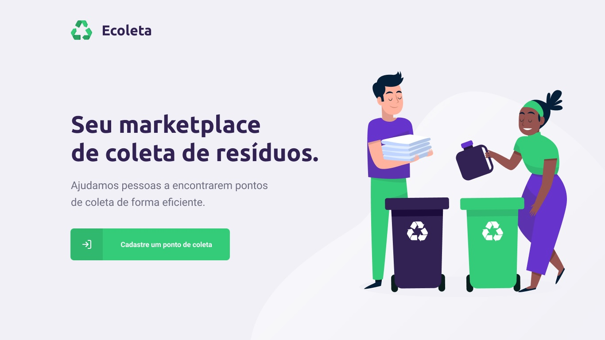

	

	Projeto desenvolvido na <strong>Next Level Week</strong> by <g-emoji class="g-emoji" alias="rocket" fallback-src="https://github.githubassets.com/images/icons/emoji/unicode/1f680.png">🚀</g-emoji><a href="https://rocketseat.com.br/">Rocketseat</a>	

 

	

 

## Intro

A Next Level Week, É evento online realizado pela Rocketseat e ministrado pelo professor Diego Schell Fernandes onde tive a oportunidade de desenvolver uma aplicação de ponta a ponta utilizando as tecnologias e conceitos mais modernos de desenvolvimento web e mobile. E o melhor? 100% gratuito!

Em homenagem a semana internacional do meio ambiente que aconteceu no mesmo período, a aplicação desenvolvida foi um marketplace de coleta de resíduos chamado Ecoleta, que conecta pessoas que precisam descartar com pontos de coletas que recebem esses resíduos.

As principais tecnologias usadas nesse projeto foram:

- Node.js
- React.js
- React Native

Foi incrível ver como essas tecnologias trabalham bem juntas e poder expandir meus conhecimentos já que hoje não atuo como desenvolvedor.

Espero que gostem!
